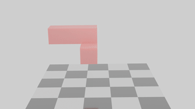
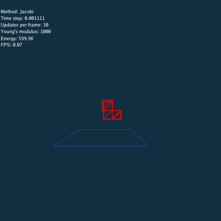
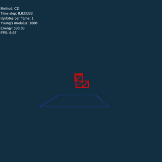
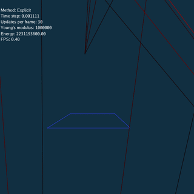
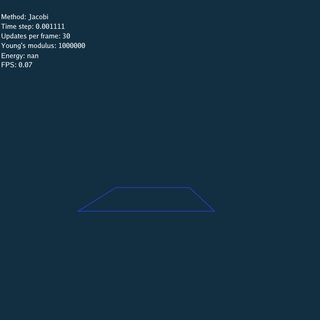
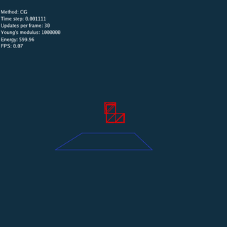
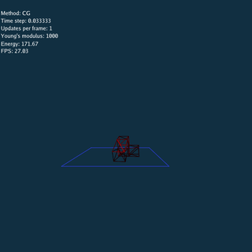

## Introduction
An implementation of 3D linear FEM based on Neohookean elasticity model (No damping force).

Three different numerical methods are implemented respectively, include:
- Explicit time integration
- Implicit time integration, solved by
    - Jacobi Method
    - Conjugate Gradient Method

Environment: `Taichi 0.6.15`

## Simulation Results

Using `Explicit`, `Jacobi`  and `CG` method respectively (Rendered by Blender).

## Analysis

For `Explicit` method, there is no constraints between nodes when updating, so the system explodes if time step or Young's modulus is large.

For `Jacobi` method, the convergence is determined by the spectral radius `\rho` of the matrix `-D^{-1}(L+U)` , Jacobi method converges if and only if `\rho` is less than `1`.

For `CG` method, the system always converges since the coefficient matrix `A` is positive definite for (solid) FEM problems.

### Same Scene
 
 
 

`Explicit` and `Jacobi` method **have to** update many times using a small time step at each frame.

`\rho = 0.0036`

### Large Time Step
 
 
 

`\rho = 1.09`

### Large Young's Modulus
 
 
 

`\rho = 1.13`

### Problems of Conjugate Gradient Method

 

1. Object rotates slowly when time step is large.

This problem is caused by the lack of damping force, add damping force to object can avoid this problem.

 

2. CG doesn't converge when both time step and Young's modulus are large.

I still don't know why CG doesn't converge in this condition, I guess this is caused by numerical accuracy.

## References

[1] [The classical FEM method and discretization methodology](http://femdefo.org/)

[2] [An Introduction to the Conjugate Gradient Method Without the Agonizing Pain](https://www.cs.cmu.edu/~quake-papers/painless-conjugate-gradient.pdf)